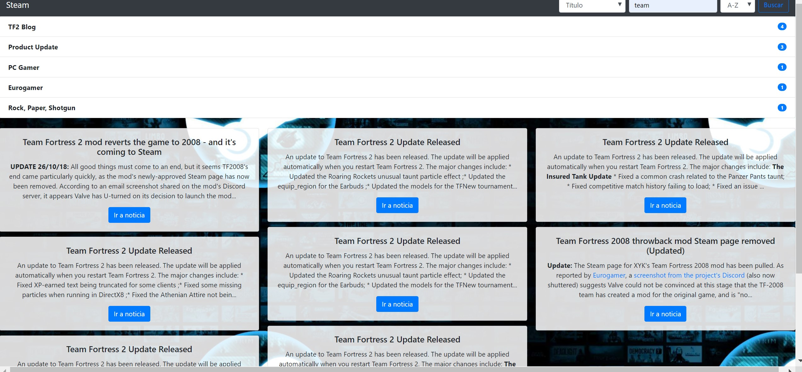
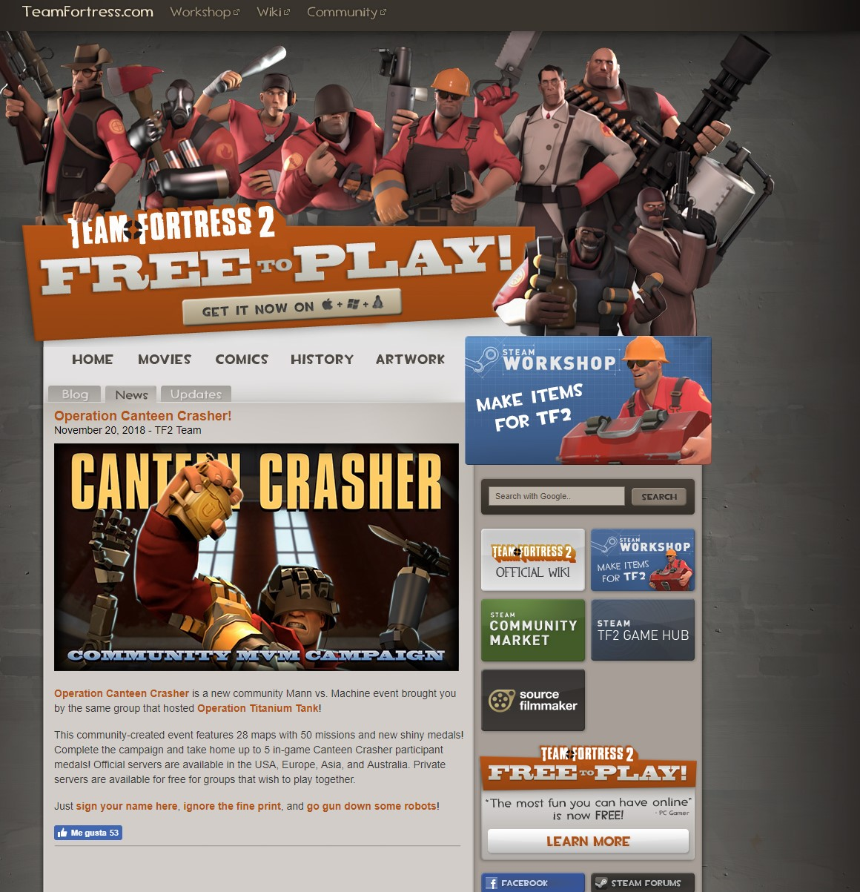
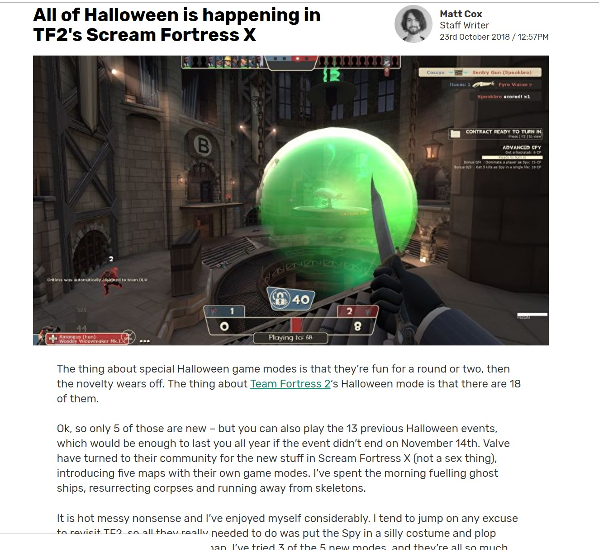

# Data Lovers Steam 👾🎮

## Índice📜

* [Preámbulo](#preámbulo)
* [Descripción](#resumen-del-proyecto)

## Preámbulo🤺

Steam es el mejor lugar para jugar, hablar sobre juegos y también crearlos.

## Resumen del proyecto 💻📝

Steam es una pagina de noticias.
Team Fortress 2, publica constantemente actualizaciones gratuitas: nuevos modos de juego, mapas y equipamiento. Esta es una página creada para usuarios interesados en noticias referentes al juego, que busca principalmente entregar a los usuarios información referente a actualizaciones,lanzamientos y eventos .

Podemos verlo en la siguiente pantalla:

En esta página podrás acceder a las útlimas noticias relacionadas con el juego Team Fortress 2.

### Cómo el producto soluciona las necesidades de los usuarios🎮

Para identificar como el producto soluciona necesidades en los usuarios nos basamos en las historias de los mismos priorizando aquellas necesidades de mayor interés en las que se destacan el poder estar informados de las noticias,lanzamientos,actualizaciones, ,eventos,poder filtrar las noticias y poder progresar dentro del juego haciendo uso de la información actualizada que nuestra pagina les proporciona.

### Historias de usuario 👩🏻🧔🏻
Yo como jugador asiduo al juego team frortress 2 quiero noticias sobre actualizaciones,lanzamientos y eventos paraavanzar mas etapas para participar de eventos.

Yo como usuario que aún no juego Team fortress 2 me gustaría leer noticias filtradas por fuentes.

